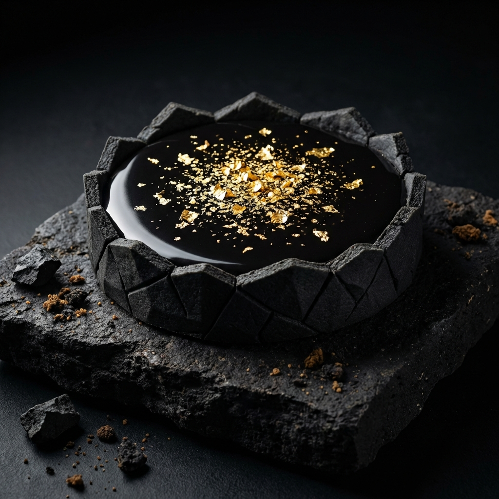

# MONOLITH | Geological Pastry Lab



> **[Live Demo](https://eugenewu1019.github.io/monolith/)**  
> *"Architecture of Taste. Ephemeral Sculpture."*

## 📖 Introduction (專案簡介)

**MONOLITH** is a high-end, immersive concept website for a fictional pastry brand that merges geology with gastronomy. The project explores the intersection of **"Vibe Coding"** and performance-driven web engineering.

**MONOLITH** 是一個極具沉浸感的概念網站，為一個將「地質學」與「甜點工藝」結合的虛構高端品牌而生。本專案旨在探索 **「氛圍編碼 (Vibe Coding)」** 與高性能網頁工程的交會點。

The site creates a "Geological Luxury" experience using "Atmospheric Blur", physics-based motion, and editorial typography, ensuring the user feels the experimental and premium quality of the brand.

網站透過「大氣渲染 (Atmospheric Blur)」、物理感運鏡以及社論式的排版設計，創造出一種「地質奢華感」，確保用戶在互動過程中能感受到品牌實驗性且高端的質感。

## ✨ Key Features (核心特色)

-   **🌍 Bilingual First (中英雙語架構)**:
    -   Complete i18n implementation with a custom `useLocale` hook for instant switching (English / Traditional Chinese).
    -   全站深度整合多語系，支援內容與介面標籤的即時切換。

-   **💎 Immersive Horizontal Gallery (沉浸式橫向藝廊)**:
    -   **Scroll-Jacked Motion**: Smooth horizontal navigation that feels like an exhibition walkthrough.
    -   **Parallax Depth**: Layers of geological textures and pastry macro-photography with 3D parallax effects.
    -   **互動體驗**: 透過滾動監聽實現規律的橫向位移與 3D 視差，如同漫步於藝廊之中。

-   **🧠 AI Sommelier Quiz (AI 甜點風味測驗)**:
    -   **Physics-Based Interaction**: Spring-physics modals and weighted preference matching logic.
    -   **Personalized Pairing**: Recommends the perfect dessert match based on user mood and flavor profiles.
    -   **智慧推薦**: 結合物理感互動介面與權重演算法，為使用者挑選最契合當下心境的風味組合。

-   **🌒 Immersive Dark Theme (沉浸式極黑美學)**:
    -   **Zodiac Palette**: A curated dark mode using customized "Zodiac Black" and "Zodiac Gold" tokens.
    -   **Micro-glow Effects**: Subtle light bleeds and mesh gradients inspired by natural mineral veins.
    -   **色彩計畫**: 採用定製的「原石黑」與「礦脈金」配色，並加入微光暈染模擬礦物紋理。

## 🛠️ Tech Stack (技術棧)

This project utilizes a modern Next.js stack focused on performance, modularity, and high-fidelity animations.

本專案採用現代 Next.js 架構開發，專注於高效能、模組化以及高質感的動態表現。

-   **Core**: [Next.js 14](https://nextjs.org/) (App Router), [TypeScript](https://www.typescriptlang.org/)
-   **Animation**: [Framer Motion](https://www.framer.com/motion/), [Lenis](https://github.com/darkroomengineering/lenis) (Smooth Scroll)
-   **Styling**: [Tailwind CSS](https://tailwindcss.com/)
-   **Icons**: [Lucide React](https://lucide.dev/)
-   **Design System**: Custom CSS Variables + Radix UI Primitives

## 🚀 Getting Started (如何執行)

To run this project locally, follow these steps:

1.  **Clone the repository**:
    ```bash
    git clone https://github.com/eugenewu1019/monolith.git
    ```
2.  **Install dependencies**:
    ```bash
    npm install
    ```
3.  **Run development server**:
    ```bash
    npm run dev
    ```
4.  **Open in browser**:
    Navigate to `http://localhost:3000` to view the local version.

## 📂 Project Structure (專案結構)

```text
monolith/
├── src/
│   ├── app/            # Next.js App Router (Pages & Routes)
│   ├── components/     # Reusable UI components & Sections
│   ├── lib/            # Utilities, i18n logic, and static data
│   └── docs/           # Brand Guidelines and documentation
├── public/             # Static assets (images, icons, fonts)
├── next.config.ts      # Deployment & Path configurations
└── README.md           # Portfolio Documentation
```

## 👨‍💻 Author

**Eugene Wu**
-   Portfolio: [GitHub](https://github.com/eugenewu1019)

---
*© 2026 MONOLITH | Geological Pastry Lab. All Rights Reserved.*
